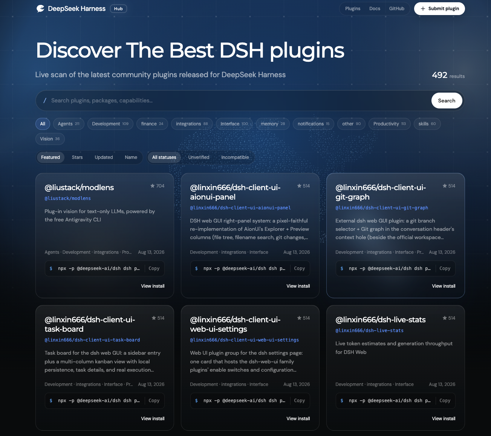

<div align="center">

# DSH Hub

**发现、比较和安装 DeepSeek Harness 社区插件。**

[浏览插件](https://dshhub.org) · [DeepSeek Harness](https://deepseek-harness.github.io/deepseek-harness/guide/quickstart) · [开发文档](docs/development.md) · [目录流水线](docs/catalog-pipeline.md)

</div>

<a href="https://dshhub.org">
  
</a>

## 关于 DSH Hub

DSH Hub 是 DeepSeek Harness 社区插件的发现入口。它持续扫描 GitHub 上可安装的插件，整理能力分类、项目说明、兼容性线索和安装命令，让使用者和 Agent 更快找到适合当前任务的扩展。

你可以在 DSH Hub：

- 按能力分类、关键词、stars、更新时间和兼容状态查找插件；
- 在详情页查看插件用途、安装方式、使用说明和来源仓库；
- 复制安装命令，回到 DeepSeek Harness 中启用插件；
- 从网页、公共 API、CLI 或 DSH 原生工具访问同一份目录；
- 提交自己的插件，让社区更容易发现它。

## 开始使用

DSH Hub 提供两种使用方法。

### 方法一：给人使用

打开 [dshhub.org](https://dshhub.org)，搜索想要的能力，或从下方分类进入完整列表。进入插件详情页后，可以查看用途、兼容性依据、来源仓库和安装命令。

也可以通过 CLI 在终端中搜索和查看详情：

```bash
# 搜索插件
npx -y @dshhubs/cli@0.1.0 search "跨会话记忆" --limit 10

# 查看某个搜索结果的详情
npx -y @dshhubs/cli@0.1.0 plugin owner/repository
```

需要让脚本处理结果时加上 `--json`。

### 方法二：给 Agent 使用

在 DeepSeek Harness 中安装 DSH Hub 搜索插件：

```bash
npx -p @deepseek-ai/dsh dsh plugin --profile web add @dshhubs/plugin-search
```

安装后，Agent 会获得两个只读工具：

- `search_dsh_plugins`：根据能力、分类和兼容状态搜索插件；
- `get_dsh_plugin`：读取候选插件的兼容性依据、使用说明和安装命令。

你可以直接告诉 Agent：

> 帮我找一个能实现跨会话记忆的 DSH 插件，比较兼容性后给出安装命令。

Agent 会先搜索并检查候选项，不会自动安装搜索结果。仓库中的 `find-dsh-plugins` Skill 提供同一套工作流，并在原生工具不可用时回退到 CLI。详细接口见[开发文档](docs/development.md#agent-与开发者入口)。

<!-- catalog:start -->
## Explore plugins by category

Discover **8802 community plugins** across 11 categories. Each category highlights five plugins; open the category to search and browse the complete list.

### agents · 2681

| Plugin | Description | Stars | Evidence |
| --- | --- | ---: | --- |
| [@dshhubs/plugin-search](https://github.com/coderPerseus/dsh-hub/tree/c3c80405693d4edbc341315cb5143be36f7a8b31/packages/dsh-plugin) | DeepSeek Harness tools for finding and inspecting plugins in the dshhub catalog | ★ 1 | declared |
| [@open-design/dsh-runtime](https://github.com/nexu-io/open-design/tree/eee03776fbffc24e40f8278b38ef6e95c011f870/packages/dsh-runtime) | DeepSeek Harness profile runtime for Open Design | ★ 87709 | declared |
| [dsh-plugin-reactive-resume](https://github.com/amruthpillai/reactive-resume/tree/ab811b5f10296871ede5c6cf913050269239f11c/packages/dsh-plugin) | DeepSeek Harness plugin for Reactive Resume: bridges your resumes and job applications into a Harness session over MCP. | ★ 40988 | declared |
| [dsh-better-sidebar](https://github.com/omdsh-dev/DSH-better-sidebar) | DSH web plugin: a VSCode-like right sidebar (explorer / editor / terminal / git / browser), isolated per conversation session. Exposes a service for other plug… | ★ 1712 | declared |
| [@wxg-prc-cpg/browser-skill-dsh-plugin](https://github.com/Tencent/BrowserSkill/tree/a9489282fa614d105e30fd131ed2692cd71308a6/packages/dsh-plugin-browserskill) | DeepSeek Harness tool plugin that exposes BrowserSkill (bsk) browser automation to the model | ★ 1135 | declared |

[View all 2681 agents plugins →](https://dshhub.org/?category=agents)

### development · 1370

| Plugin | Description | Stars | Evidence |
| --- | --- | ---: | --- |
| [@open-design/dsh-runtime](https://github.com/nexu-io/open-design/tree/eee03776fbffc24e40f8278b38ef6e95c011f870/packages/dsh-runtime) | DeepSeek Harness profile runtime for Open Design | ★ 87709 | declared |
| [dsh-better-sidebar](https://github.com/omdsh-dev/DSH-better-sidebar) | DSH web plugin: a VSCode-like right sidebar (explorer / editor / terminal / git / browser), isolated per conversation session. Exposes a service for other plug… | ★ 1712 | declared |
| [@open-pets/dsh](https://github.com/alvinunreal/openpets/tree/042844d8e3cd43d8984a2742865d100c3a7be4a4/packages/dsh) | Local first, desktop companion platform with animated pets, plugin SDK and coding-agent integrations. | ★ 1078 | declared |
| [aegis](https://github.com/GanyuanRan/Aegis) | Make AI coding agents architecture-aware: baseline-first, evidence-verified, drift-checked, and safe across long tasks. | ★ 1032 | declared |
| [graph-memory](https://github.com/adoresever/graph-memory) | Knowledge graph memory for DeepSeek Harness and OpenClaw — cross-session recall, PageRank, communities, and vector search | ★ 563 | declared |

[View all 1370 development plugins →](https://dshhub.org/?category=development)

### finance · 499

| Plugin | Description | Stars | Evidence |
| --- | --- | ---: | --- |
| [dsh-damage-pulse](https://github.com/wssfk12138/dsh-damage-pulse) | DeepSeek Harness balance monitor with cache-aware damage-number animations for every token charge. | ★ 24 | declared |
| [@feiyang666/dsh-usage-plugin](https://github.com/feiyang-dev/dsh-usage-plugin) | DeepSeek Harness usage & cost tracker plugin: per-call token/cache-hit stats, peak/off-peak billing, DeepSeek balance query, CSV/JSON/PNG export with custom de… | ★ 22 | declared |
| [@pinkbanana/dsh-balance](https://github.com/crazywoola/dsh-balance) | DeepSeek Harness plugin that shows API balances and models in Settings, with balance below the chat composer | ★ 19 | declared |
| [dsh-context-doctor](https://github.com/Zhenyu98/dsh-context-doctor) | DSH 上下文注入审计插件：统计 AGENTS.md 指令链 / 技能目录 / 工具 schema / MCP 工具的 token 成本，检测重复与冲突；原生 Context Doctor 面板 + context_audit 工具。 | ★ 12 | declared |
| [dsh-opencode-go-usage](https://github.com/Xenia0922/dsh-opencode-go-usage) | OpenCode Go 用量与花费面板 — DeepSeek Harness 插件:可拖拽缩放的悬浮仪表盘,实时展示 OpenCode Go 配额、逐请求用量与花费 | ★ 10 | declared |

[View all 499 finance plugins →](https://dshhub.org/?category=finance)

### integrations · 985

| Plugin | Description | Stars | Evidence |
| --- | --- | ---: | --- |
| [dsh-plugin-reactive-resume](https://github.com/amruthpillai/reactive-resume/tree/ab811b5f10296871ede5c6cf913050269239f11c/packages/dsh-plugin) | DeepSeek Harness plugin for Reactive Resume: bridges your resumes and job applications into a Harness session over MCP. | ★ 40988 | declared |
| [@open-pets/dsh](https://github.com/alvinunreal/openpets/tree/042844d8e3cd43d8984a2742865d100c3a7be4a4/packages/dsh) | Local first, desktop companion platform with animated pets, plugin SDK and coding-agent integrations. | ★ 1078 | declared |
| [@agentrq/dsh-plugin-agentrq](https://github.com/agentrq/agentrq/tree/b63a82b6228e61034a9a6cc37f551b2e912f1aa5/plugins/deepseek-harness) | AgentRQ task manager for DeepSeek Harness: create, manage, and auto-pull AgentRQ tasks without leaving the harness | ★ 1074 | declared |
| [@anionex/dsh-vision-toolkit](https://github.com/Anionex/dsh-vision-toolkit) | DeepSeek Harness-native integration for agent-vision-toolkit: image Q&A, OCR, grounding, UI restoration, pixel diff, Artifacts, and Web UI. | ★ 550 | declared |
| [@zseven-w/dsh-ios](https://github.com/ZSeven-W/dsh-ios) | DeepSeek Harness plugin for the iOS Simulator — build, run, and interact with a live simulator stream inside a conversation. Tested with DSH 0.1.0-rc.6. | ★ 156 | declared |

[View all 985 integrations plugins →](https://dshhub.org/?category=integrations)

### interface · 2371

| Plugin | Description | Stars | Evidence |
| --- | --- | ---: | --- |
| [@open-design/dsh-runtime](https://github.com/nexu-io/open-design/tree/eee03776fbffc24e40f8278b38ef6e95c011f870/packages/dsh-runtime) | DeepSeek Harness profile runtime for Open Design | ★ 87709 | declared |
| [dsh-better-sidebar](https://github.com/omdsh-dev/DSH-better-sidebar) | DSH web plugin: a VSCode-like right sidebar (explorer / editor / terminal / git / browser), isolated per conversation session. Exposes a service for other plug… | ★ 1712 | declared |
| [@open-pets/dsh](https://github.com/alvinunreal/openpets/tree/042844d8e3cd43d8984a2742865d100c3a7be4a4/packages/dsh) | Local first, desktop companion platform with animated pets, plugin SDK and coding-agent integrations. | ★ 1078 | declared |
| [@agentrq/dsh-plugin-agentrq](https://github.com/agentrq/agentrq/tree/b63a82b6228e61034a9a6cc37f551b2e912f1aa5/plugins/deepseek-harness) | AgentRQ task manager for DeepSeek Harness: create, manage, and auto-pull AgentRQ tasks without leaving the harness | ★ 1074 | declared |
| [@anionex/dsh-vision-toolkit](https://github.com/Anionex/dsh-vision-toolkit) | DeepSeek Harness-native integration for agent-vision-toolkit: image Q&A, OCR, grounding, UI restoration, pixel diff, Artifacts, and Web UI. | ★ 550 | declared |

[View all 2371 interface plugins →](https://dshhub.org/?category=interface)

### memory · 481

| Plugin | Description | Stars | Evidence |
| --- | --- | ---: | --- |
| [@mindmemos/deepseek-harness-plugin](https://github.com/mindscale-noah/MindMemOS/tree/0c2fdb1ed41d09c7446f809d00bc11821e96cb24/plugins/deepseek-harness-plugin) | DeepSeek Harness (dsh) plugin that recalls and writes MindMemOS memories through the mindmemos CLI. | ★ 938 | declared |
| [graph-memory](https://github.com/adoresever/graph-memory) | Knowledge graph memory for DeepSeek Harness and OpenClaw — cross-session recall, PageRank, communities, and vector search | ★ 563 | declared |
| [dsh-mnemon](https://github.com/Grivn/dsh-mnemon) | Three-tier memory control plane for DeepSeek Harness: persistent runtime context, searchable project documents, pluggable long-term memory, smart routing, supe… | ★ 156 | declared |
| [dsh-mnemon](https://github.com/omdsh-dev/dsh-mnemon) | Three-tier memory system for DeepSeek Harness with nine pluggable providers, smart routing, independent task Agents, WebUI, and headless tools. | ★ 60 | declared |
| [dsh-git-memory](https://github.com/seriousz158/dsh-memory) | A local Git-backed long-term memory bundle for DeepSeek Harness | ★ 52 | declared |

[View all 481 memory plugins →](https://dshhub.org/?category=memory)

### notifications · 306

| Plugin | Description | Stars | Evidence |
| --- | --- | ---: | --- |
| [dsh-notification](https://github.com/omdsh-dev/dsh-notification) | Browser desktop notifications when the DeepSeek Harness finishes a turn: configurable per-outcome toggles and include/exclude keyword rules, shown through the… | ★ 55 | declared |
| [dsh-notifier](https://github.com/THEWOLFWALKER/dsh-notifier) | DSH 统一通知推送插件：一个 notify() API 打天下 + 多渠道 adapter；远程审批/远程会话支持 telegram/feishu/qq/wxpusher/wechat/dingtalk 六通道双向回传；移动指挥中心（长任务心跳 / 疑似卡住提醒 / 通知按钮停止任务）；开放事件源（其他插件经 no… | ★ 31 | declared |
| [dsh-lark-bot](https://github.com/PlutoKeating/dsh-lark-bot) | Bridge DeepSeek Harness (dsh) into Feishu / Lark with streaming cards, project workspaces, approvals and scheduling | ★ 18 | declared |
| [@dsh-external/dsh-ui-progress](https://github.com/lhh010/dsh-ui-progress) | DSH Web UI 会话进度插件：输入框停靠区常驻会话进度条（todos 真实进度 / 无投影默认 100% / 中断橘红态 / 实时 token 生成速率），零核心改动。 | ★ 8 | declared |
| [dsh-memoir](https://github.com/Qinling-Melon-Farmers/dsh-memoir) | Project persistent memory and session-lessons distillation for DeepSeek Harness (DSH): an agent records a session's work summary, lessons learned, and next-act… | ★ 8 | declared |

[View all 306 notifications plugins →](https://dshhub.org/?category=notifications)

### other · 2236

| Plugin | Description | Stars | Evidence |
| --- | --- | ---: | --- |
| [dshmarket](https://github.com/dsh-market/dsh-market) | Visual plugin market inside DeepSeek Harness — browse, search, and one-click install community plugins. · DSH 可视化插件市场：逛一逛，点一下，装好。 | ★ 637 | declared |
| [anime-find](https://github.com/cocofhu/anime-find) | DeepSeek Harness 插件：对话内多源搜番，卡片详情、磁力复制与规则流媒体在线播放 | ★ 131 | declared |
| [@nanmicoder/dsh-auto-mode](https://github.com/NanmiCoder/dsh-auto-mode) | Sandbox-first automatic permission policy for DeepSeek Harness | ★ 74 | declared |
| [deepseek-idesign](https://github.com/Devin-AXIS/deepseek-design/tree/0781cb6f619bd617b6b64512d168fa47de6da88c/packages/deepseek-idesign) | iPolloWork Design Studio and its curated design templates as a native DeepSeek Harness conversation view. | ★ 67 | declared |
| [zat-dsh-engine](https://github.com/mishibeikejie/zat-dsh-engine) | Zat-DSH Engine — the visual plugin marketplace for DeepSeek Harness. Browse, search, install, update and uninstall community plugins from GitHub's dsh-plugin t… | ★ 64 | declared |

[View all 2236 other plugins →](https://dshhub.org/?category=other)

### productivity · 2035

| Plugin | Description | Stars | Evidence |
| --- | --- | ---: | --- |
| [dsh-plugin-reactive-resume](https://github.com/amruthpillai/reactive-resume/tree/ab811b5f10296871ede5c6cf913050269239f11c/packages/dsh-plugin) | DeepSeek Harness plugin for Reactive Resume: bridges your resumes and job applications into a Harness session over MCP. | ★ 40988 | declared |
| [dsh-better-sidebar](https://github.com/omdsh-dev/DSH-better-sidebar) | DSH web plugin: a VSCode-like right sidebar (explorer / editor / terminal / git / browser), isolated per conversation session. Exposes a service for other plug… | ★ 1712 | declared |
| [@wxg-prc-cpg/browser-skill-dsh-plugin](https://github.com/Tencent/BrowserSkill/tree/a9489282fa614d105e30fd131ed2692cd71308a6/packages/dsh-plugin-browserskill) | DeepSeek Harness tool plugin that exposes BrowserSkill (bsk) browser automation to the model | ★ 1135 | declared |
| [@agentrq/dsh-plugin-agentrq](https://github.com/agentrq/agentrq/tree/b63a82b6228e61034a9a6cc37f551b2e912f1aa5/plugins/deepseek-harness) | AgentRQ task manager for DeepSeek Harness: create, manage, and auto-pull AgentRQ tasks without leaving the harness | ★ 1074 | declared |
| [dsh-tongflow](https://github.com/tong-io/tongflow/tree/a5f2bac33f963d950a1721c3b3e59951a8f01e3e/packages/dsh-tongflow) | TongFlow studio plugin for DeepSeek Harness (dsh): film-crew style project model, agent-authored TongFlow workflows, deterministic media generation, embedded c… | ★ 859 | declared |

[View all 2035 productivity plugins →](https://dshhub.org/?category=productivity)

### skills · 868

| Plugin | Description | Stars | Evidence |
| --- | --- | ---: | --- |
| [@dshhubs/plugin-search](https://github.com/coderPerseus/dsh-hub/tree/c3c80405693d4edbc341315cb5143be36f7a8b31/packages/dsh-plugin) | DeepSeek Harness tools for finding and inspecting plugins in the dshhub catalog | ★ 1 | declared |
| [@open-design/dsh-runtime](https://github.com/nexu-io/open-design/tree/eee03776fbffc24e40f8278b38ef6e95c011f870/packages/dsh-runtime) | DeepSeek Harness profile runtime for Open Design | ★ 87709 | declared |
| [dsh-plugin-reactive-resume](https://github.com/amruthpillai/reactive-resume/tree/ab811b5f10296871ede5c6cf913050269239f11c/packages/dsh-plugin) | DeepSeek Harness plugin for Reactive Resume: bridges your resumes and job applications into a Harness session over MCP. | ★ 40988 | declared |
| [@wxg-prc-cpg/browser-skill-dsh-plugin](https://github.com/Tencent/BrowserSkill/tree/a9489282fa614d105e30fd131ed2692cd71308a6/packages/dsh-plugin-browserskill) | DeepSeek Harness tool plugin that exposes BrowserSkill (bsk) browser automation to the model | ★ 1135 | declared |
| [aegis](https://github.com/GanyuanRan/Aegis) | Make AI coding agents architecture-aware: baseline-first, evidence-verified, drift-checked, and safe across long tasks. | ★ 1032 | declared |

[View all 868 skills plugins →](https://dshhub.org/?category=skills)

### vision · 628

| Plugin | Description | Stars | Evidence |
| --- | --- | ---: | --- |
| [dsh-tongflow](https://github.com/tong-io/tongflow/tree/a5f2bac33f963d950a1721c3b3e59951a8f01e3e/packages/dsh-tongflow) | TongFlow studio plugin for DeepSeek Harness (dsh): film-crew style project model, agent-authored TongFlow workflows, deterministic media generation, embedded c… | ★ 859 | declared |
| [@anionex/dsh-vision-toolkit](https://github.com/Anionex/dsh-vision-toolkit) | DeepSeek Harness-native integration for agent-vision-toolkit: image Q&A, OCR, grounding, UI restoration, pixel diff, Artifacts, and Web UI. | ★ 550 | declared |
| [dsh-vision-router](https://github.com/ysr666/dsh-vision-router) | Eyes for text-only DeepSeek Harness agents: built-in free vision chain (no key) + pixel-level vision tools (Q&A, grounding, crop, pixel diff, colors, OCR, SVG… | ★ 469 | declared |
| [@huiliyi37/dsh-tianshu-tui](https://github.com/huiliyi37/dsh-tianshu-tui) | dsh-tianshu-tui: an interactive TUI layer over the dsh-base profile, installable as a plugin (`dsh plugin --profile tui add @huiliyi37/dsh-tianshu-tui`) | ★ 194 | declared |
| [@dsh-external/dsh-ads](https://github.com/Nagi-ovo/dsh-ads) | DSH ad-infestation plugin: localized Chinese portal ads and English scam-ad parody, with fake pop-ups, a jackpot wheel, rewarded inference ads, and fake-game a… | ★ 163 | declared |

[View all 628 vision plugins →](https://dshhub.org/?category=vision)

<sub>Catalog snapshot `2026-08-22T07:02:32.511Z-b238698b8d05`, generated 2026-08-22T07:02:32.511Z.</sub>
<!-- catalog:end -->

## 提交插件

访问 [DSH Hub](https://dshhub.org)，点击页面右上角的 **Submit plugin**，填写 GitHub 仓库地址。目录服务会检查仓库结构、安装信息和文档，并在后续目录更新中收录符合条件的插件。

## 开发与贡献

本地开发、项目结构、Cloudflare 资源和校验命令见[开发文档](docs/development.md)。插件发现、分类、翻译和发布流程见 [Catalog pipeline](docs/catalog-pipeline.md)。

欢迎通过 Issue 或 Pull Request 改进目录、搜索体验和插件生态。
